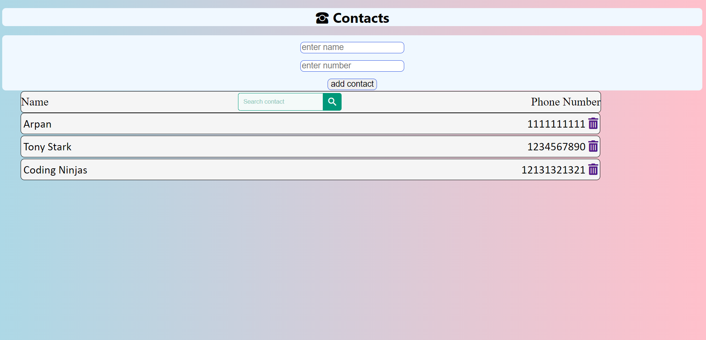

# conlactlist
 add your contact number in address book
# Express-Contact-List

# How To Run

* Install Node.js(nodejs.org).
* Clone, Fork or donwload the repositry from the terminal.
* Open in VS Code.
* Run Command npm install.
* Run Command npm start
* Open in your browser and go to (https://localhost:8000)

# Features
* Adding the Contacts.
* Deleting or Removing the contacts.
### The Contacts will save in Mongodb Database.

## Screenshots

